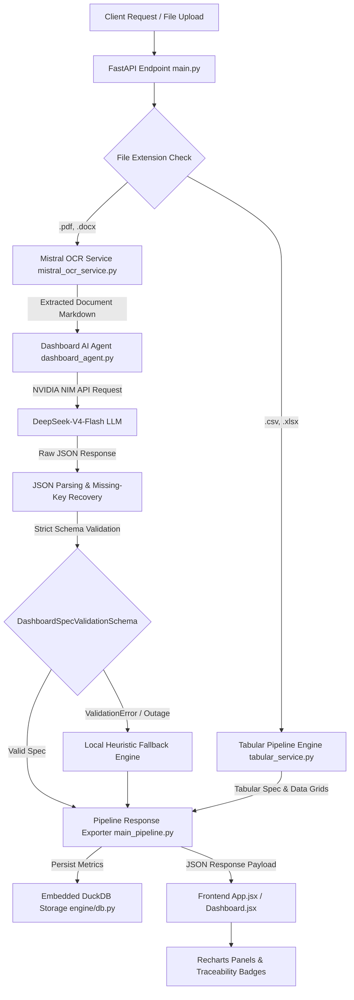

# Visualizer System Architecture & Data Flow Notes

This document describes how data flows through the **Visualizer** application, how the backend pipeline components interact with external services, and how AI responses are parsed and validated.

---

## 1. System Architecture Overview



---

## 2. End-to-End Data Flow

### Step 1: Ingestion & Dual-Branch Routing (`main.py` & `main_pipeline.py`)
1. An uploaded `UploadFile` is received at `/api/upload` (or `/api/v1/upload`).
2. `main.py` validates file size ($\le 16\text{ MB}$) and file extension (`.pdf`, `.xlsx`, `.csv`, `.docx`). Invalid file extensions (e.g. `.txt`, `.png`) return HTTP 400.
3. `run_file_to_dashboard_pipeline` inspects the file extension:
   * **Branch A (Tabular Files)**: `.csv` and `.xlsx` files route to `process_tabular_file`. Pandas reads the sheets, computes statistical summaries (`mean`, `median`, `std`, value counts), generates chart objects, and formats preview rows in $<0.5\text{s}$.
   * **Branch B (Unstructured Files)**: `.pdf` and `.docx` files route to `process_document_with_mistral_ocr`.

---

### Step 2: Document OCR Extraction (`mistral_ocr_service.py`)
1. Raw byte buffer or disk file is converted to a Base64 Data URL payload (`data:application/pdf;base64,...`).
2. Executed over HTTP to the official Mistral OCR API (`mistral-ocr-latest`) with `table_format="markdown"`, `extract_header=True`, `extract_footer=True`, and `include_image_base64=True`.
3. Mistral OCR returns page markdown arrays. `mistral_ocr_service.py` resolves table placeholders (`[tbl-x.md]`), decodes embedded figure images to local disk (`data/outputs/assets/`), and stitches pages into a unified Markdown document string (`# Extracted Document... ## Page 1... ## Page 2...`).

---

### Step 3: DeepSeek LLM Dashboard Generation (`dashboard_agent.py`)
1. Markdown text is capped at `MAX_INPUT_CONTEXT_LEN = 25000` characters.
2. Sent to NVIDIA NIM API (`https://integrate.api.nvidia.com/v1`) requesting model `deepseek-ai/deepseek-v4-flash` with `temperature=0.2` and `response_format={"type": "json_object"}`.
3. System prompt instructs DeepSeek to extract:
   * `dashboard_title`
   * `executive_summary`
   * `kpis` (with `page_range`)
   * `key_value_pairs` (with `page_number`)
   * `keywords` (with relevance scores)
   * `charts` (with `x_data`, `y_data`, and `page_range`)

---

### Step 4: AI Response Parsing, Missing-Key Recovery, and Pydantic Schema Validation

#### Actual Code Path & Error Handling:
1. **Raw Content Formatting**: Regex strips markdown block wrappers (`re.sub(r"^```json\s*", "", raw_content)`).
2. **JSON Syntax Parsing**: `json.loads(clean_json_str)` parses the string into a Python `dict`.
3. **Missing-Key Recovery**:
   * If `json.loads` succeeds with valid JSON, missing keys are auto-populated by local recovery heuristics:
     * `if not parsed_spec.get("keywords"):` $\rightarrow$ calls `extract_local_keywords(markdown_text)`
     * `if not parsed_spec.get("charts"):` $\rightarrow$ calls `extract_charts_from_markdown_tables(markdown_text)`
     * `if not parsed_spec.get("key_value_pairs"):` $\rightarrow$ calls `extract_local_key_value_pairs(markdown_text)`
4. **Strict Pydantic Schema & Type Validation**:
   * `parsed_spec` is validated against `DashboardSpecValidationSchema(**parsed_spec)`.
   * **Strict Rules Enforced**: `charts` must be a list, `y_data` must contain strictly numeric values (`List[Union[int, float]]`), `score` must be numeric (`Union[int, float]`).
   * **Validation Error Routing**: If DeepSeek returns malformed shapes or non-numeric strings in `y_data` (e.g. `["100", "N/A"]`), `DashboardSpecValidationSchema` raises a `ValidationError`. The exception block logs the warning and safely routes execution to `generate_heuristic_fallback_dashboard_spec(markdown_text)`.

---

### Step 5: Caching & Persistence Layer (`engine/db.py`)
1. `main_pipeline.py` computes SHA256 file hash of the uploaded file payload.
2. DuckDB database connection (`data/app_data.duckdb`) executes `save_document_analytics(file_name, analytics)` inside a reentrant thread lock (`db_write_lock = threading.RLock()`).
3. If DuckDB fails to load, `db.py` falls back to SQLite3 (`data/visualizer.sqlite3`).

---

### Step 6: Frontend Visualization (`React + Recharts`)
1. Response payload returns to `App.jsx` and populates `Dashboard.jsx`.
2. **KPIs & Page Badges**: `StatsCards.jsx` renders KPI cards with `.kpi-page-badge` source location tags.
3. **Charts & Responsive Intervals**: `ChartPanel.jsx` renders `BarChart`, `LineChart`, `AreaChart`, and `PieChart`.
   * **Minimized Card View**: Sets `interval="preserveStartEnd"` on `<XAxis>` to auto-sample tick labels.
   * **Maximized Card View**: Sets `interval={0}` with $-45^\circ$ label rotation to unhide 100% of labels.
   * **Pie Chart Legend**: Renders `.pie-custom-legend-wrapper` flex container with scrollbars to keep 20+ legend categories strictly inside card borders.
