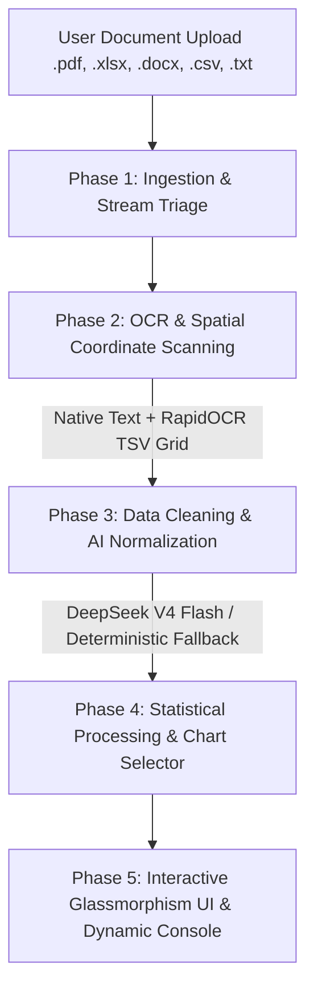

# Visualizer

> Enterprise-grade document ingestion and data visualization system powered by hybrid local OCR and DeepSeek AI.

[](LICENSE)
[](https://python.org)
[](https://fastapi.tiangolo.com)
[](https://reactjs.org)
[](https://vitejs.dev)
[](backend/tests)

---

## ✨ Features

- **Multi-Format Document Ingestion**: Ingests `.xlsx`, `.csv`, `.pdf`, `.docx`, and `.txt` files up to 16MB without data truncation or schema lock.
- **Hybrid Local-Cloud OCR Pipeline**: Pairs zero-cost ONNX spatial coordinate scanning (`RapidOCR`) with cloud models (`deepseek-ai/deepseek-v4-flash` & `nvidia/nemotron-ocr-v2`) to prevent image payload crash limits.
- **Pure Python Statistical Engine**: `tabular_processor.py` computes complete statistical summaries (`mean`, `median`, `std_dev`, `min`, `max`, null counts, categorical frequencies) without native C-extensions (`pandas`/`numpy`) for zero-dependency execution in locked-down environments.
- **Dynamic Processing Console**: Holographic 4-stage processing stepper UI (`Ingestion`, `OCR`, `Processing`, `Visualization`) featuring live stopwatch timers (`00:00.00`), scanning beam animations, smooth terminal ticker logs, and targeted error diagnostics.
- **Auto-Generated Dashboards**: Interactive sortable data grids, numeric metric cards, DeepSeek executive TL;DR summary cards, keyword pill clouds, and auto-selected Recharts canvas (Line, Bar, Pie).
- **Zero-Downtime Deterministic Fallback**: Automatic `parse_tsv_grid` backstop ensures 100% processing uptime during cloud API outages or rate limits.

---

## 🏗️ System Architecture & 5-Phase Pipeline



### Model & API Routing Map

| Model / Endpoint | Role & Purpose |
|---|---|
| `deepseek-ai/deepseek-v4-flash` | Normalizes spatial TSV grids, cleans monetary values, and formats dynamic $N$-column tables. |
| `nvidia/nemotron-ocr-v2` | Base64 vision API for direct computer vision OCR on complex image payloads. |
| `parse_tsv_grid` (Deterministic Engine) | Zero-cost local backstop parser guaranteeing 100% uptime if AI APIs time out. |

---

## 🛠️ Tech Stack

### Backend
- **Framework**: Python 3.14 + FastAPI + Uvicorn
- **Parsers**: PyMuPDF (`fitz`), `python-docx`, `openpyxl`, `RapidOCR` ONNX runtime
- **Testing**: `pytest` + `pytest-mock` + `httpx`

### Frontend
- **Framework**: React 18 + Vite
- **Styling**: Vanilla CSS (Cyber-Purple Glassmorphism Design System)
- **Icons & Charts**: Lucide Icons + Recharts

---

## 🚀 Complete Local Setup & Quick Start Guide

Follow this step-by-step guide to clone, install, configure, and launch **Visualizer** on your local machine.

---

### 📋 1. System Prerequisites

Ensure you have the following installed on your operating system:

| Tool | Minimum Version | Recommended / Tested | Check Command |
|---|---|---|---|
| **Python** | `v3.10` | `v3.14+` | `python --version` |
| **Node.js** | `v18.0.0` | `v20.0.0+` | `node -v` |
| **npm** | `v9.0.0` | `v10.0.0+` | `npm -v` |
| **Git** | `v2.30.0` | `v2.40.0+` | `git --version` |

*Note: An **NVIDIA API Key** is optional. If configured, Visualizer uses cloud `DeepSeek V4 Flash` and `Nemotron OCR v2`. If omitted, Visualizer automatically falls back to local zero-cost ONNX `RapidOCR` and deterministic TSV grid parsing.*

---

### 💻 2. Step-by-Step Installation

#### Step A: Clone the Repository
Open your terminal or PowerShell and clone the repository:
```bash
git clone https://github.com/bhargav-Q/Visualizer.git
cd Visualizer
```

#### Step B: Set Up Backend Virtual Environment
Create and activate a Python virtual environment to isolate backend dependencies:

* **On Windows (PowerShell):**
  ```powershell
  python -m venv .venv
  .\.venv\Scripts\Activate.ps1
  ```
* **On Linux / macOS (Bash / Zsh):**
  ```bash
  python3 -m venv .venv
  source .venv/bin/activate
  ```

Once activated, install all backend requirements:
```bash
pip install -r backend/requirements.txt
```

#### Step C: Configure Environment Variables
Create a file named `.env` in the root workspace directory (`Visualizer/.env`):

```ini
# NVIDIA API Credentials (Optional - Cloud LLM & Vision Features)
NVIDIA_API_KEY=your_nvidia_api_key_here

# AI Model Definitions
TABLE_AI_MODEL=deepseek-ai/deepseek-v4-flash
TEXT_AI_MODEL=deepseek-ai/deepseek-v4-flash
NEMOTRON_OCR_URL=https://ai.api.nvidia.com/v1/cv/nvidia/nemotron-ocr-v2
```

#### Step D: Install Frontend Dependencies
Navigate into the `frontend/` directory and install Node dependencies:
```bash
cd frontend
npm install
cd ..
```

---

### 🏃 3. Launching the Application Services

To run Visualizer, launch both the backend API server and frontend UI dev server in **two separate terminal windows**:

#### 📍 Terminal 1 — Backend Service (`FastAPI`):
```bash
# Ensure virtual environment (.venv) is activated
cd backend
uvicorn main:app --reload --port 8000
```
- **Backend API Base URL**: `http://localhost:8000`
- **Interactive Swagger API Documentation**: `http://localhost:8000/docs`
- **ReDoc API Documentation**: `http://localhost:8000/redoc`

#### 📍 Terminal 2 — Frontend Application (`React + Vite`):
```bash
# In a new terminal window
cd frontend
npm run dev
```
- **Frontend Web Application URL**: `http://localhost:5173`

---

### 🧪 4. Verifying System Health

Run the complete automated backend test suite from the root project directory:

```bash
# Windows (PowerShell)
.\.venv\Scripts\python.exe -m pytest backend/tests

# Linux / macOS
.venv/bin/pytest backend/tests
```

**Expected Verification Output:**
```text
======================== 10 passed in 0.23s ========================
```


---

## 👥 Contributing & Collaborator Guide

We welcome contributions! To maintain code quality, system stability, and architectural integrity, all collaborators must follow these guidelines.

### 📁 Repository Structure Map

```text
Visualizer/
├── backend/
│   ├── main.py                        # FastAPI router & parallel thread pool executor
│   ├── parsers/                       # File format parsers (.pdf, .docx, .xlsx, .csv, .txt, .image)
│   │   └── spatial_grid.py            # RapidOCR bounding box coordinate clustering & alignment
│   ├── processors/                    # Data transformation engines
│   │   ├── tabular_processor.py       # Pure Python statistical analysis engine (Pandas-free)
│   │   ├── ocr_processor.py           # DeepSeek AI table extractor & Nemotron OCR handler
│   │   └── text_processor.py          # AI document summarization & keyword ranker
│   └── tests/                         # Pytest unit and integration test suite
├── frontend/
│   ├── src/
│   │   ├── App.jsx                    # Application shell & console routing
│   │   └── components/                # Modular React UI components
│   │       ├── FileUpload.jsx         # Drag-and-drop file upload zone
│   │       ├── DynamicProcessingConsole.jsx # Live 4-stage stepper & stopwatch console
│   │       └── Dashboard.jsx          # Interactive metrics, charts, & text views
│   └── package.json                   # Frontend dependencies
└── test_files/                        # Dataset files for manual & integration testing
```

### 🔒 Mandatory Architectural Guardrails

1. **Pure Python Statistical Calculations**: Do NOT introduce `pandas` or `numpy` to `tabular_processor.py`. All statistical routines must remain pure Python (`statistics`, `collections`) to preserve compatibility on restricted enterprise environments.
2. **Buffer Stream Resets (`seek(0)`)**: Whenever modifying file parsers, always invoke `file.file.seek(0)` before and after buffer reads to prevent empty stream errors in `main.py`.
3. **Deterministic Fallback Backstop**: Any cloud AI API integration must be wrapped with a local fallback backstop (e.g. `parse_tsv_grid`) so the backend achieves 100% upload uptime even during API outages.

### 🌿 Git & Pull Request Workflow

1. **Create a Feature Branch:**
   ```bash
   git checkout -b feat/your-feature-name  # Or fix/your-bug-fix
   ```
2. **Commit Conventions:** Follow conventional commit messages:
   - `feat(scope): add new feature`
   - `fix(scope): fix bug`
   - `docs(scope): update documentation`
3. **Pre-PR Verification Checklist:**
   - [ ] Run `python -m pytest backend/tests` and confirm all 10 tests pass.
   - [ ] Verify frontend UI builds cleanly (`npm run build` inside `frontend/`).
   - [ ] Ensure no secret API keys are committed in `.env`.

---

## 📜 License

Distributed under the MIT License. See [LICENSE](LICENSE) for more information.

