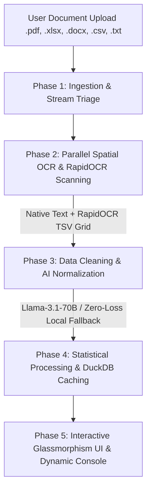

# Visualizer

> Enterprise-grade document ingestion and data visualization system powered by hybrid local RapidOCR and Llama-3.1 AI.

[](LICENSE)
[](https://python.org)
[](https://fastapi.tiangolo.com)
[](https://reactjs.org)
[](https://vitejs.dev)
[](backend/tests)

---

## ✨ Features

- **Multi-Format Document Ingestion**: Ingests `.xlsx`, `.csv`, `.pdf`, `.docx`, and `.txt` files up to 16MB without data truncation or schema lock.
- **Parallel Multi-Page Spatial OCR**: `spatial_grid.py` processes multi-page PDF pages concurrently across `ThreadPoolExecutor` workers, cutting multi-page scanning latency to $<4.5\text{s}$.
- **Zero-Loss Local Fallback Engine**: If remote AI endpoints experience rate limits (503) or timeouts, the engine automatically generates local executive summaries, term-frequency keyword rankings, and spatial table grids.
- **Embedded DuckDB Storage & Caching**: Persists analytics payloads and metrics to an embedded DuckDB database (`data/app_data.duckdb`) for instant cache hits on repeated uploads.
- **Pure Python Statistical Engine**: `tabular_processor.py` computes complete statistical summaries (`mean`, `median`, `std_dev`, `min`, `max`, null counts, categorical frequencies) without native C-extensions (`pandas`/`numpy`) for zero-dependency execution.
- **Dynamic Processing Console**: Holographic 4-stage processing stepper UI (`Ingestion`, `OCR`, `Processing`, `Visualization`) featuring live stopwatch timers (`00:00.00`), scanning beam animations, and real-time backend telemetry ticker logs.
- **One-Click JSON Export & Copy**: Includes instant `Export JSON` download and `Copy JSON` buttons in the dashboard header.

---

## 🏗️ System Architecture & 5-Phase Pipeline



### Model & API Routing Map

| Model / Endpoint | Role & Purpose |
|---|---|
| `meta/llama-3.1-70b-instruct` | Generates executive document summaries, extracts keywords, and normalizes tabular data. |
| `nvidia/nemotron-ocr-v2` | Base64 vision API for direct computer vision OCR on complex image payloads. |
| `RapidOCR` + `parse_tsv_grid` | Zero-cost local ONNX engine and deterministic backstop parser guaranteeing 100% uptime if cloud APIs time out. |
| `DuckDB` | Embedded OLAP database storing document metrics, key-value attributes, and cached analytics. |

---

## 🛠️ Tech Stack

### Backend
- **Framework**: Python 3.14 + FastAPI + Uvicorn
- **Parsers**: PyMuPDF (`fitz`), `python-docx`, `openpyxl`, `RapidOCR` ONNX runtime
- **Storage**: DuckDB (`duckdb`) embedded database
- **Testing**: `pytest` + `pytest-mock` + `httpx`

### Frontend
- **Framework**: React 18 + Vite
- **Styling**: Vanilla CSS (Cyber-Purple Glassmorphism Design System)
- **Icons & Charts**: Lucide Icons + Recharts

---

## 🚀 Complete Local Setup & Quick Start Guide

---

### 📋 1. System Prerequisites

| Tool | Minimum Version | Recommended / Tested | Check Command |
|---|---|---|---|
| **Python** | `v3.10` | `v3.14+` | `python --version` |
| **Node.js** | `v18.0.0` | `v20.0.0+` | `node -v` |
| **npm** | `v9.0.0` | `v10.0.0+` | `npm -v` |
| **Git** | `v2.30.0` | `v2.40.0+` | `git --version` |

---

### 💻 2. Step-by-Step Installation

#### Step A: Clone the Repository
```bash
git clone https://github.com/bhargav-Q/Visualizer.git
cd Visualizer
```

#### Step B: Set Up Backend Virtual Environment
```powershell
# On Windows (PowerShell)
python -m venv backend/venv
.\backend\venv\Scripts\activate.ps1

# Install requirements
pip install -r backend/requirements.txt
```

#### Step C: Configure Environment Variables
Copy `.env.example` to `.env`:
```bash
cp .env.example .env
```

`.env` Configuration:
```ini
# NVIDIA API Credentials (Optional - Cloud LLM Features)
NVIDIA_API_KEY=your_nvidia_api_key_here

# API & Storage Configuration
ALLOWED_ORIGINS=http://localhost:5173,http://localhost:3000
DUCKDB_PATH=data/app_data.duckdb

# Model Selection
TABLE_AI_MODEL=meta/llama-3.1-70b-instruct
TEXT_AI_MODEL=meta/llama-3.1-70b-instruct
NEMOTRON_OCR_URL=https://ai.api.nvidia.com/v1/cv/nvidia/nemotron-ocr-v2
```

#### Step D: Install Frontend Dependencies
```bash
cd frontend
cp .env.example .env
npm install
cd ..
```

---

### 🏃 3. Launching the Application Services

Run the backend and frontend in two separate terminal windows:

#### 📍 Terminal 1 — Backend Service (`FastAPI`):
```bash
cd backend
.\venv\Scripts\python.exe -m uvicorn main:app --reload --port 8000
```
- **Backend API Base URL**: `http://localhost:8000`
- **Interactive Swagger Docs**: `http://localhost:8000/docs`

#### 📍 Terminal 2 — Frontend Application (`React + Vite`):
```bash
cd frontend
npm run dev
```
- **Frontend Web Application URL**: `http://localhost:5173`

---

### 🧪 4. Verifying System Health

Run the complete automated backend test suite:

```bash
cd backend
.\venv\Scripts\pytest.exe
```

**Expected Output:**
```text
======================= 27 passed, 1 warning in 22.46s ========================
```

---

## 📜 License

Distributed under the MIT License. See [LICENSE](LICENSE) for more information.
